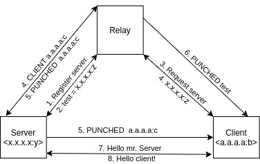

# Mysterium Challenge

## Summary

My take on the [Winter is coming](https://github.com/mysteriumnetwork/winter-is-coming) challenge! This code is a mix of the [Talk to zombies](https://github.com/mysteriumnetwork/winter-is-coming/blob/master/quests/Talk_to_Zombies.md) and [Zombie Hole Punching](https://github.com/mysteriumnetwork/winter-is-coming/blob/master/quests/Zombie_Hole_Punching.md) challenges. It is able to connect to peers using NAT hole-punching as well as host and play games.

## Design

### NAT Hole-Punching (Zombie Hole Punching)

To establish the connection I designed a 3rd party, this is called a relay node and is not behind any NAT, so anyone can send him messages. The relay node is used to register servers and it is also used for clients to access these servers. Theoretically, you can register your server with any name but for simplicity's sake I just hardcoded it to always use test.

The protocol works as explained in this image:

Firstly, in steps 1 and 2 the server is registered in the relay node. Then, in steps 3 and 4 the server is requested to the relay node and returned to the client. Parallel to that that, the relay node notifies the server of a new client (still step 4), this way the server will be able to create the NAT hole for the client to communicate. The hole is created in step 5 and the relay is notified of its creation too, then the relay is able to notify the client that the hole is created in step 6, and we are able to handshake in steps 7 and 8.

As you can see, because the server is behind a NAT, the port we are using in the code is translated to a random one (y becomes z) and the same happens with the client (b becomes c), if this didn't happen we wouldn't need the protocol, as the packets from the server would reach the client without issue and the port we have to send them too would be known.

### Game server design (Talk to Zombies)

The game server is a simple loop waiting for messages, here is a list of all the possible messages the client can send and its effect:
- **CREATE \<game_name>:** creates a new game called \<game_name> and joins it.
- **JOIN \<game_name>:** the client joins the game called \<game_name> if it exists, was not part of it already and it hasn't started yet.
- **START \<game_name>:** the starts the game called \<game_name> if it hasn't started yet. This will create a new thread which runs the game, this way we can run games in parallel.
- **SHOOT \<game_name> \<x> \<y>:** if the game \<game_name> is running a shot is made to position (x,y), when the game receives the shot it replies with BOOM \<client_ip> [0|1] [{zombie}], so if the result is 1, which means that the zombie has been hit, it will end the game and will notify the clients if they won or lost.

The game server is theoretically able to run multiple games simultaneously and have multiple clients playing different games at the same time.

## How to run

Running the code is very simple, we will need 3 machines: the relay, the client and the server.

For the relay I will leave one running on this IP: `52.174.62.223`. The code is running on an Ubuntu VM on Azure and it just runs this command: `go run . r`. The only requeriment of this node is that the port specified in the code (11000) will be mapped to our machine's same port, so either port forwarding in your router or a public IP and no NAT (which is what I'm doing). Don't worry for the costs as I have some free Azure credits, but please notify me after testing it so I can shut it down and use the credits some other way (\*cough\* running Mysterium nodes \*cough\*)

For running the client and the server, we will use the following commands:
- Client: `go run . c 52.174.62.223`
- Server: `go run . s 52.174.62.223`

If you want to see the zombie's moves during a game you should use this command on the root of the repository folder:
- Windows PowerShell: `Get-Content moves.txt -Wait`
- Ubuntu: `tail -f ./data.txt`

You can also see them on the server command line, but adding them on the client's command line was a problem as we also need to be typing there.

## Problems and what I learned

This is the first time I use Go for developing a project and I really loved the language, it's really simple and easy to learn, but I'm sure I still have a lot to learn. If I used a language I'm more familiar with, I would have probably divided the project in different layers (logic and communication in this case) so the logic is independent of the communication and therefore can be easily changed or reutilized in another project.

One of the problems the project has is that if the client takes too much time to connect to the server after it is registered, the NAT translation might have already changed and the connection can fail, so there cannot be a lot of time between launching the server and the client. To minimize this problem, the client will send keep alive messages every 20 seconds to the server which he will reply to keep the connection active.
